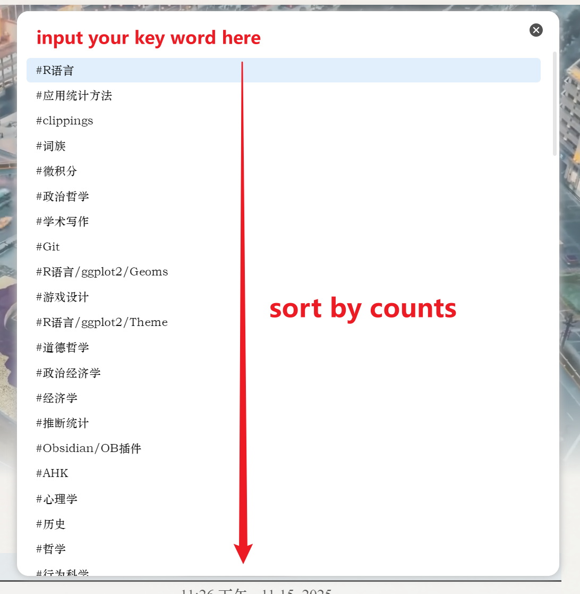

# 标签导航器 - Obsidian 插件
[英文](README.md) | [中文](README_zh-CN.md)
这款工具能让您<u>**轻松且迅速**</u>通过标签快速访问您的笔记。
您是否觉得搜索标签很麻烦？一个标签的原始搜索流程大概是这样的：**打开**左侧栏 -> **选择**全局搜索 -> **选择**“标签” -> 输入您的标签 -> 在一个小列表中选择您的标签 -> 查看结果（所有内容都集中在侧边栏中）
这效率太低，操作也太麻烦了！让我们把流程简化为一步，这样就能更方便地查看结果了！

# 简易入门指南
安装插件后，您可以将此插件的唯一命令（“打开标签搜索”）绑定到一个快捷键上，例如“alt+t”。
按下快捷键或者通过“命令面板”调出“<u>标签导航面板</u>”。
输入您想要导航到的标签，然后按“回车”键。
- 如果存在标签注释（通过前置标记的别名进行匹配），则直接打开该注释
- 如果只有一个注释包含该标签，则直接打开该注释
- 如果多个注释包含该标签，则显示一个选择列表供用户选择
- 选择面板将为您提供一个图标，用于将标签搜索表达式填入全局搜索收件箱中

/>

/>

# 特性
?? 智能标签导航
- **基于频率的排序**：标签按照使用频率从高到低进行排序，这样就能方便地找到常用的标签
- 允许模糊搜索
### 🔍 方便的搜索集成
在标签文件选择器中添加了一个搜索按钮，以便能够快速将标签插入到全局搜索中。


## 安装步骤
### 通过奥比安迪社区插件
1. 打开奥布里迪安设置2. 前往“社区插件”选项卡3. 点击“浏览”，然后搜索“标签导航器”4. 当您找到该插件时，请点击“安装”按钮。5. 安装完成后启用该插件
### 手动安装
1. 从“发布”页面下载最新版本2. 将这些文件提取到您的 Obsidian 资源库的“.obsidian/plugins/tag-navigator/”目录中。3. 重新加载“奥秘石”插件，并在社区插件中启用“标签导航器”功能。
# 配置
目前，该插件无需任何额外配置即可直接使用。
标签注释功能
要使用标签注释功能，请先创建一个注释，然后在前言部分添加别名：
```yaml
这是一个 YAML 格式的文档。它包含了一些键值对---
别名：["#标签名称", "abc", "哈哈"]---
```

在搜索此标签时，该插件会优先打开此标签下的备注内容。
# 发展信息
此插件基于 R. W. 布利克汉的原始作品，并由田成坦进行了修改和优化。
### 技术栈
- JavaScript/TypeScript
- 奥比丹 API
### 贡献事项
欢迎提出问题和提交拉取请求！
### 许可证
MIT 许可协议 - 详情请参阅 [许可协议](LICENSE) 文件
### 支持
如果您遇到问题或有建议，请通过以下方式联系：
- 在 GitHub 项目库中提交一个【问题】（请访问：https://github.com/EarthTan/tag-navigator/issues）
- 通过电子邮件联系作者
***

享受更智能的标签导航体验吧！

## 更新日志
1.0.0 版本
- 初始版本发布
- 基本的标签导航功能
- 智能的导航逻辑
- 搜索集成功能
